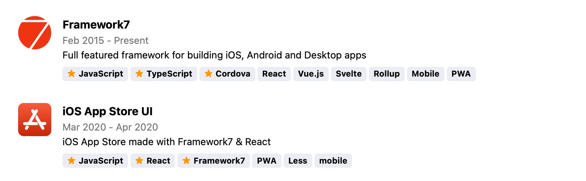

# Codersrank Portfolio Widget

<!-- DOCS_START -->

Codersrank Portfolio Widget is a web component that allows you easily integrate portfolio information from your [CodersRank](https://codersrank.io) profile to your personal website:



## Install from NPM

Widget script available through NPM:

```
npm i @codersrank/portfolio --save
```

After installation you need to import and register web component:

```js
import CodersrankPortfolio from '@codersrank/portfolio';

// register web component as <codersrank-portfolio> element
window.customElements.define('codersrank-portfolio', CodersrankPortfolio);
```

## Install from CDN

Widget can also be downloaded or linked directly from CDN:

```html
<!-- replace x.x.x with actual version -->
<script src="https://unpkg.com/@codersrank/portfolio@x.x.x/codersrank-portfolio.min.js"></script>
```

In this case it is not required to register web component, it is already registered as `<codersrank-portfolio>` element.

## Usage

As it is a web component the usage is pretty simple, just add widget HTML tag with your [CodersRank](https://codersrank.io) username

```html
<codersrank-portfolio username="YOUR_USERNAME"></codersrank-portfolio>
```

## Widget Attributes

Widget supports following properties as HTML element attributes:

| Name          | Type      | Default | Description                                                                               |
| ------------- | --------- | ------- | ----------------------------------------------------------------------------------------- |
| `username`    | `string`  |         | Your [CodersRank](https://codersrank.io) username                                         |
| `max-items`   | `number`  |         | Limit number of portfolio items to display                                                |
| `grid`        | `boolean` | `false` | Enables grid layout. Number of columns is configurable with `--grid-columns` CSS variable |
| `logos`       | `boolean` | `true`  | Defines whether to show portfolio logos/image or not                                      |
| `dates`       | `boolean` | `true`  | Defines whether to show portfolio item dates or not                                       |
| `title`       | `boolean` | `true`  | Defines whether to show portfolio item title or not                                       |
| `description` | `boolean` | `true`  | Defines whether to show portfolio item description or not                                 |
| `company`     | `boolean` | `true`  | Defines whether to show portfolio item company name or not                                |
| `skills`      | `boolean` | `true`  | Defines whether to show portfolio skills or not                                           |
| `links`       | `boolean` | `true`  | Defines whether to show portfolio demo and source links or not                            |
| `branding`    | `boolean` | `true`  | Displays "Powered by CodersRank" link                                                     |

For example:

```html
<codersrank-portfolio username="YOUR_USERNAME" logos></codersrank-portfolio>
```

## Styling

It is possible to customize widget colors with CSS Custom Properties (CSS Variables) by setting them directly on the widget element with style attribute or in CSS.

There are following CSS Custom Properties are available:

| Property                        | Value                       |
| ------------------------------- | --------------------------- |
| `--preloader-color`             | `#72a0a8`                   |
| `--item-spacing`                | `2em`                       |
| `--item-border-radius`          | `0px`                       |
| `--item-border`                 | `none`                      |
| `--item-padding`                | `0px`                       |
| `--item-bg-color`               | `transparent`               |
| `--grid-columns`                | `1`                         |
| `--logo-size`                   | `48px`                      |
| `--logo-margin`                 | `16px`                      |
| `--title-font-size`             | `1.15em`                    |
| `--title-font-weight`           | `bold`                      |
| `--title-text-color`            | `inherit`                   |
| `--title-opacity`               | `1`                         |
| `--location-text-color`         | `inherit`                   |
| `--location-opacity`            | `0.55`                      |
| `--location-font-size`          | `inherit`                   |
| `--location-font-weight`        | `inherit`                   |
| `--date-text-color`             | `inherit`                   |
| `--date-opacity`                | `0.55`                      |
| `--date-font-size`              | `inherit`                   |
| `--date-font-weight`            | `inherit`                   |
| `--company-text-color`          | `inherit`                   |
| `--company-opacity`             | `0.55`                      |
| `--company-font-size`           | `inherit`                   |
| `--company-font-weight`         | `inherit`                   |
| `--description-font-size`       | `inherit`                   |
| `--description-font-weight`     | `inherit`                   |
| `--description-text-color`      | `inherit`                   |
| `--description-opacity`         | `1`                         |
| `--tag-border`                  | `none`                      |
| `--tag-star-color`              | `#ff9900`                   |
| `--tag-bg-color`                | `rgba(0, 0, 100, 0.075)`    |
| `--tag-font-size`               | `0.85em`                    |
| `--tag-font-weight`             | `bold`                      |
| `--tag-padding`                 | `0.35em 0.57em`             |
| `--tag-margin`                  | `0.28em`                    |
| `--tag-border-radius`           | `4px`                       |
| `--tag-text-color`              | `inherit`                   |
| `--link-margin`                 | `0.28em`                    |
| `--link-font-size`              | `0.85em`                    |
| `--link-font-weight`            | `600`                       |
| `--link-text-color`             | `#72a0a8`                   |
| `--link-opacity`                | `1`                         |
| `--link-text-decoration`        | `none`                      |
| `--link-text-transform`         | `uppercase`                 |
| `--link-border`                 | `none`                      |
| `--link-border-radius`          | `4px`                       |
| `--link-bg-color`               | `transparent`               |
| `--link-padding`                | `2px 4px`                   |
| `--link-hover-bg-color`         | `rgba(114, 160, 168, 0.15)` |
| `--link-hover-text-color`       | -                           |
| `--link-hover-opacity`          | -                           |
| `--link-hover-text-decoration`  | -                           |
| `--link-hover-border`           | -                           |
| `--link-hover-bg-color`         | -                           |
| `--link-active-text-color`      | -                           |
| `--link-active-opacity`         | -                           |
| `--link-active-text-decoration` | -                           |
| `--link-active-border`          | -                           |
| `--link-active-bg-color`        | -                           |
| `--branding-text-color`         | `inherit`                   |

For example, to change portfolio title color to `purple` and font-size to `20px`, add this to CSS stylesheet:

```css
codersrank-portfolio {
  --title-text-color: purple;
  --title-font-size: 20px;
}
```

## Use As Image

It is also possible to insert Portfolio widget as an image. It is useful in places where you can't integrate web component, or for example on your GitHub profile README.md page.

Image URL is the following:

```
https://cr-ss-service.azurewebsites.net/api/ScreenShot?widget=portfolio&username=YOUR_USERNAME
```

It accepts all widget attributes as query string parameters, plus one extra parameter:

| Name    | Type     | Default | Description                                                                                                                                                                     |
| ------- | -------- | ------- | ------------------------------------------------------------------------------------------------------------------------------------------------------------------------------- |
| `width` | `number` | `800`   | Width of widget element (generated image). Note that generated image has @2x pixel density, so the PNG image will be actually generated in @2x size from the one specified here |
| `style` | `string` |         | `style` attribute value (here you can specify all CSS variables)                                                                                                                |

For example:

```html

```

Note that you need to URL Encode some of the characters, for example `#` should be `%23` and `#ff0` color should be specified as `%23ff0` in query.

## Contribution

Yes please! See the [contributing guidelines](https://github.com/codersrank-org/portfolio-widget/blob/master/CONTRIBUTING.md) for details.

## Licence

This project is licensed under the terms of the [MIT license](https://github.com/codersrank-org/portfolio-widget/blob/master/LICENSE).
